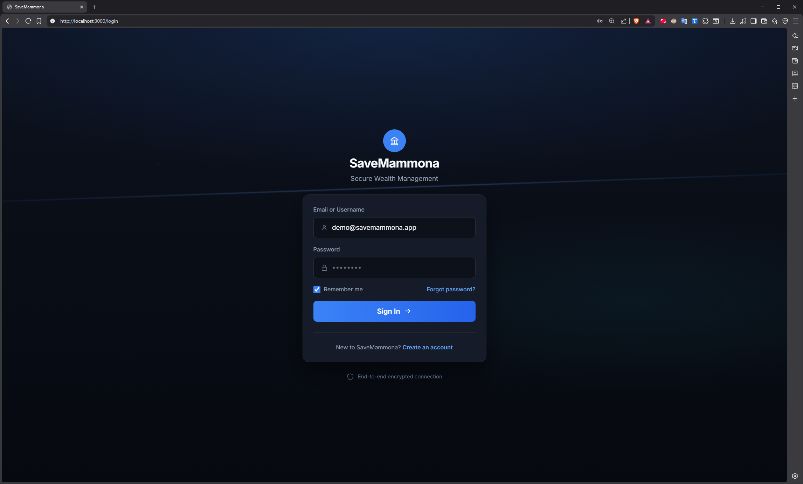
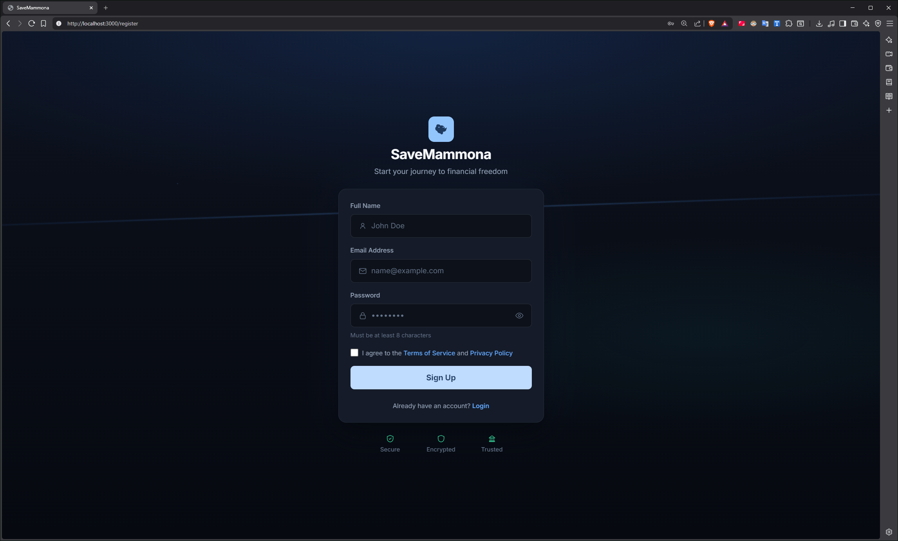
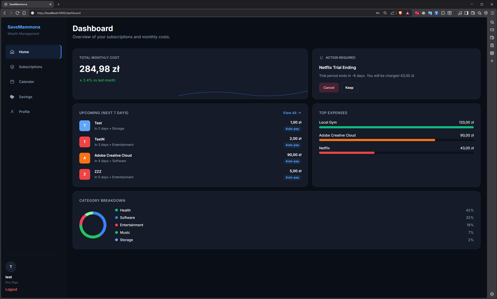
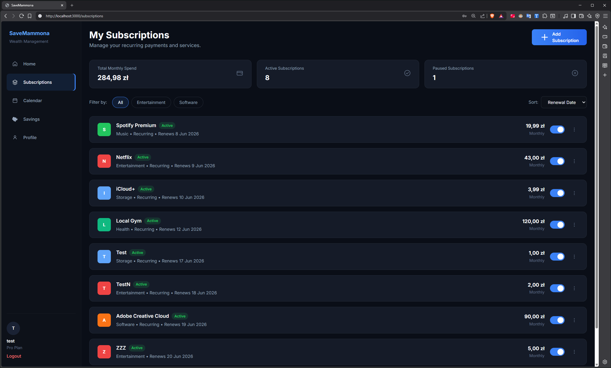
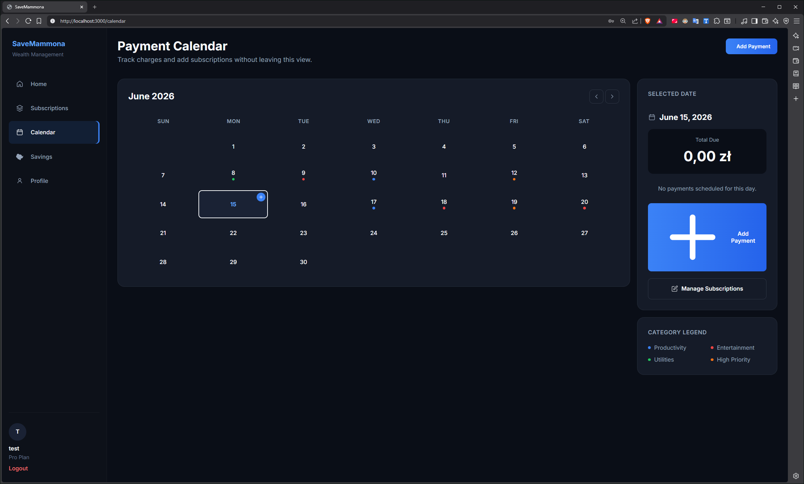
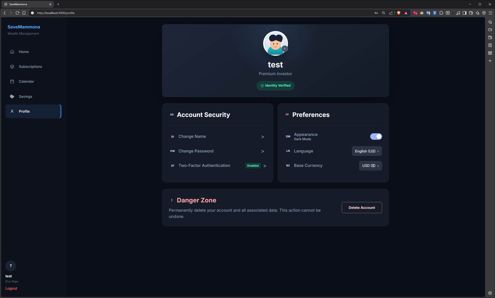
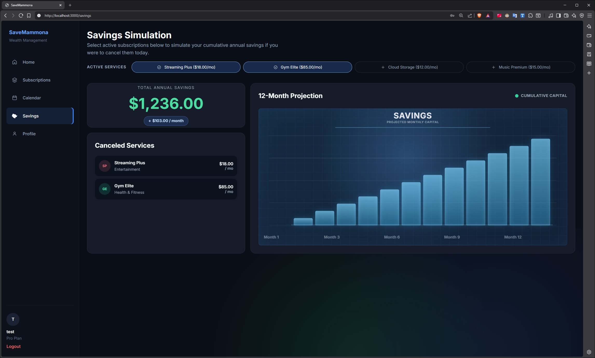

# SaveMammona

**SaveMammona** to webowa aplikacja do zarządzania subskrypcjami i cyklicznymi wydatkami. Użytkownik może śledzić miesięczne koszty, przeglądać nadchodzące płatności, dodawać subskrypcje z kalendarza oraz symulować oszczędności po rezygnacji z usług.

| | |
|---|---|
| **Typ** | SPA (Single Page Application) |
| **Stos** | React 18, TypeScript, Vite 4, React Router 7 |
| **Autentykacja** | Firebase Authentication |
| **Dane subskrypcji** | `localStorage` (MVP) |
| **Analityka** | Google Analytics 4 (Firebase Measurement ID) |
| **UX research** | Hotjar (heatmapy, nagrania sesji, ankiety) |

---

## Spis treści

1. [Funkcjonalności](#funkcjonalności)
2. [Wymagania](#wymagania)
3. [Instalacja i konfiguracja](#instalacja-i-konfiguracja)
4. [Uruchomienie](#uruchomienie)
5. [Trasy aplikacji](#trasy-aplikacji)
6. [Struktura projektu](#struktura-projektu)
7. [Zrzuty ekranu aplikacji](#zrzuty-ekranu-aplikacji)
8. [Google Analytics](#google-analytics)
9. [Hotjar](#hotjar)
10. [Komendy npm](#komendy-npm)
11. [Build i wdrożenie](#build-i-wdrożenie)

---

## Funkcjonalności

### Autentykacja
- Ekran powitalny, logowanie i rejestracja (Firebase Auth)
- Chronione trasy - dostęp do panelu tylko po zalogowaniu
- Zapamiętywanie adresu e-mail w formularzu logowania

### Dashboard
- Miesięczny koszt aktywnych subskrypcji
- Alert o kończącym się okresie próbnym
- Nadchodzące płatności (7 dni)
- Top wydatki i podział na kategorie

### Subskrypcje
- Lista subskrypcji ze statystykami i filtrami
- Przełączanie statusu active / paused
- Formularz dodawania (nazwa, kwota PLN, kategoria, data odnowienia, auto-pay, **recurring**)

### Kalendarz płatności
- Widok miesięczny z oznaczeniem dni płatności
- Subskrypcje **recurring** wyświetlane co miesiąc w ten sam dzień
- **Dodawanie płatności w tym samym widoku** - przycisk "Add Payment" oraz "+" na komórce dnia
- Panel boczny ze szczegółami wybranego dnia

### Oszczędności i profil
- Symulacja oszczędności po anulowaniu usług (wykres)
- Profil użytkownika i wylogowanie

---

## Wymagania

- **Node.js** >= 20.x
- **npm**
- Konto **Firebase** (Authentication + opcjonalnie Analytics)
- Konto **Hotjar** (opcjonalnie, do badań UX po wdrożeniu)

---

## Instalacja i konfiguracja

### 1. Klonowanie i zależności

```bash
git clone <url-repozytorium>
cd Projekt_TPF
npm ci
```

### 2. Zmienne środowiskowe

Utwórz plik **`.env`** w katalogu głównym projektu (obok `package.json`):

```env
VITE_FIREBASE_API_KEY=...
VITE_FIREBASE_AUTH_DOMAIN=...
VITE_FIREBASE_PROJECT_ID=...
VITE_FIREBASE_STORAGE_BUCKET=...
VITE_FIREBASE_MESSAGING_SENDER_ID=...
VITE_FIREBASE_APP_ID=...
VITE_FIREBASE_MEASUREMENT_ID=G-XXXXXXXXXX
```

| Zmienna | Opis |
|---------|------|
| `VITE_FIREBASE_*` | Konfiguracja projektu Firebase (konsola Firebase → Project settings) |
| `VITE_FIREBASE_MEASUREMENT_ID` | ID strumienia **Google Analytics 4** powiązanego z Firebase |

> Plik `.env` nie jest dostępny za pośrednictwem repozytorium w celu zapewnienia bezpieczeństwa struktury projektu.

### 3. Firebase Console

1. Włącz **Authentication** → metoda **Email/Password**
2. Utwórz użytkownika testowego lub zarejestruj się przez `/register`
3. Włącz **Google Analytics** w projekcie Firebase, aby uzyskać `MEASUREMENT_ID`

---

## Uruchomienie

```bash
npm run dev
```

Aplikacja: [http://localhost:3000](http://localhost:3000)

1. Wejdź na `/register` lub zaloguj się na `/login`
2. Po zalogowaniu nastąpi przekierowanie na `/dashboard`
3. Przy pierwszym uruchomieniu ładowane są przykładowe subskrypcje demo do `localStorage`

---

## Trasy aplikacji

| Ścieżka | Dostęp | Opis |
|---------|--------|------|
| `/` | Publiczny | Ekran powitalny |
| `/login` | Publiczny | Logowanie |
| `/register` | Publiczny | Rejestracja |
| `/dashboard` | Chroniony | Dashboard |
| `/subscriptions` | Chroniony | Lista subskrypcji |
| `/subscriptions/new` | Chroniony | Dodaj subskrypcję (formularz pełnostronicowy) |
| `/calendar` | Chroniony | Kalendarz płatności + dodawanie inline |
| `/calendar/new` | Chroniony | Dodaj jednorazowy wpis do kalendarza (formularz pełnostronicowy) |
| `/savings` | Chroniony | Symulacja oszczędności |
| `/profile` | Chroniony | Profil użytkownika |

---

## Struktura projektu

```
Projekt_TPF/
├── docs/screenshots/     # Zrzuty ekranu do dokumentacji
│   ├── app/              # Widoki aplikacji
│   ├── analytics/        # Google Analytics 4
│   └── hotjar/           # Hotjar
├── public/
├── src/
│   ├── components/       # UI, layout, formularze
│   ├── context/          # AuthContext (Firebase)
│   ├── hooks/            # useSubscriptions
│   ├── lib/              # firebase.ts
│   ├── pages/            # Widoki (dashboard, kalendarz, auth…)
│   ├── styles/           # Tokeny CSS, layout
│   ├── types/            # TypeScript (Subscription, User)
│   └── utils/            # Storage, walidacja, kalendarz
├── .env                  # Sekrety (lokalnie, nie w repo)
├── package.json
└── vite.config.ts
```

---

## Zrzuty ekranu aplikacji

Poniżej widoki głównych ekranów aplikacji SaveMammona (web, motyw ciemny).

### Logowanie



### Rejestracja



### Dashboard



Panel główny: koszt miesięczny, alerty, nadchodzące płatności, top wydatki i wykres kategorii.

### Subskrypcje


Lista subskrypcji z filtrami, statystykami i przełącznikiem active/paused.

### Dodawanie subskrypcji



### Kalendarz płatności



Kalendarz miesięczny z oznaczeniem dni płatności.

### Kalendarz - dodawanie płatności



Dodawanie płatności bez opuszczania widoku kalendarza (przycisk **Add Payment** i **+** na dniu).

### Symulacja oszczędności



### Profil użytkownika


---

## Google Analytics

Aplikacja jest przygotowana do integracji z **Google Analytics 4** poprzez Firebase (`VITE_FIREBASE_MEASUREMENT_ID`). Po wdrożeniu produkcyjnym można śledzić ruch użytkowników, konwersje (rejestracja, logowanie) oraz popularność poszczególnych widoków.

### Panel raportów GA4


Przegląd użytkowników, sesji i kluczowych metryk za wybrany okres.

### Ruch w czasie rzeczywistym


Monitorowanie aktywnych użytkowników na żywo po publikacji aplikacji.


---

## Hotjar

Aplikacja integruje **Hotjar / ContentSquare** poprzez skrypt wczytywany w `<head>` każdej strony (`index.html`). Po wdrożeniu zbierane są nagrania sesji, heatmapy kliknięć oraz dane o zachowaniu użytkowników.

### Nagrania sesji


Lista nagranych sesji użytkowników z datą, czasem trwania i urządzeniem.

### Heatmapa kliknięć


Wizualizacja obszarów najczęściej klikanych przez użytkowników.

---

## Komendy npm

| Komenda | Opis |
|---------|------|
| `npm run dev` | Serwer deweloperski z hot reload (port 3000) |
| `npm run build` | Kompilacja TypeScript + build produkcyjny (`dist/`) |
| `npm run preview` | Podgląd zbudowanej wersji |
| `npm run lint` | ESLint |

---

## Build i wdrożenie

```bash
npm run build
firebase deploy --only hosting
```

Aplikacja jest wdrożona na **Firebase Hosting**: [https://savemammona.web.app](https://savemammona.web.app)

Artefakt w katalogu `dist/` można hostować również na:

- dowolnym serwerze statycznym (Netlify, Vercel, nginx)

Po wdrożeniu:

1. Zweryfikuj dane w **Google Analytics 4** (realtime, events)
2. Podłącz domenę w **Hotjar** i zbieraj heatmapy / nagrania
3. Utwórz użytkowników testowych w Firebase Authentication

---

## Wymagania pozafunkcjonalne (skrót)

| Obszar | Realizacja |
|--------|------------|
| **UX/UI** | Dark mode, design system (tokeny CSS), font Inter, responsywność |
| **Wydajność** | Vite, szybki build, operacje na `localStorage` synchroniczne |
| **Bezpieczeństwo** | Firebase Auth, `.env` poza repo, chronione trasy |
| **Dostępność** | Etykiety formularzy, ARIA na kalendarzu i nawigacji |
| **Analityka** | GA4 przez Firebase Measurement ID |
| **Badania UX** | Hotjar - heatmapy, nagrania, ankiety |

---

## Autorzy

Kacper Samolej, Kajetan Sobol, Piotr Nycz
